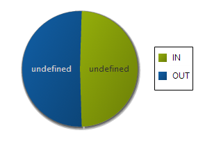
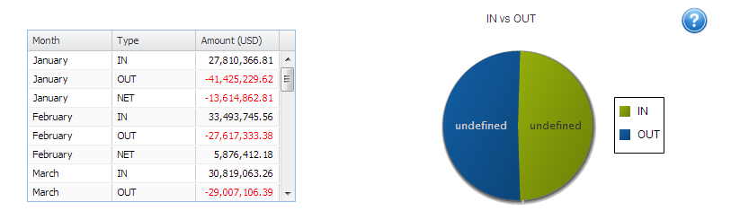
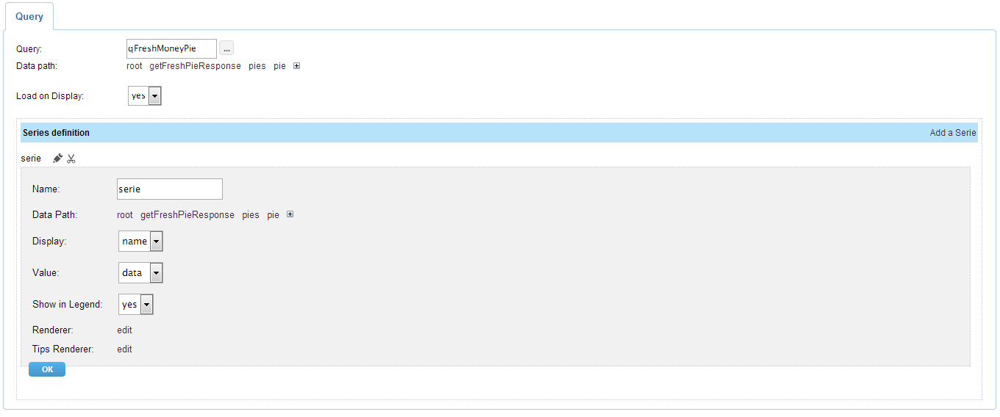
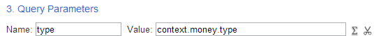
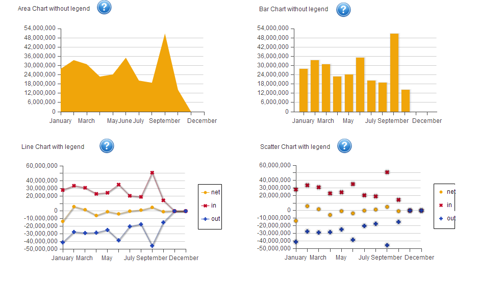
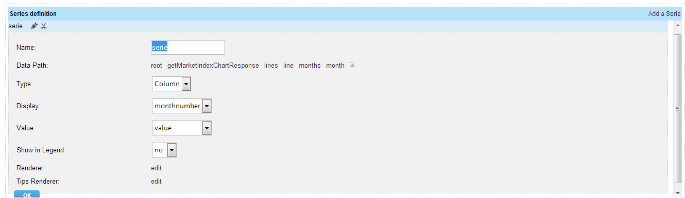

.. image:: http://www.dreamface-interactive.com/img/dreamface-interactive.png

DreamFace's Charts Graphical Components
==============================
Charts are the components used to display the graphical information. There are two chart components:

* :ref:`PieChart <pieChart>`
* :ref:`MixedChart <mixedChart>`

.. _pieChart:

PieChart
--------

This component is used to display a data in the graphical form using the pie chart.

Example: piechart with legeng

Component Attributes
^^^^^^^^^^^^^^^^^^^^^^^^^^^^^^^

General attributes:

================  ===================================================  ========================  ==========
Name              Description                                          Possible Values           Expression
================  ===================================================  ========================  ==========
Name              Component name                                       Any string                no
Series            Chart series definition. Opens a window to define    Series definition array   no
                  series
Colors            Colors for the pie sectors.                          String, comma separated   no
                                                                       values, e.g: red, green
Visible           Component visibility                                 yes, no                   yes
================  ===================================================  ========================  ==========

**Series** attribute parameters:

================  ===================================================  ========================  ==========
Name              Description                                          Possible Values           Expression
================  ===================================================  ========================  ==========
Query             DataQuery used to retrieve data for the component    DataQuery name            no
Data path         Path in the DataQuery structure definition to get    Data path string array    no
                  the data
Load on Display   Defines if the component tries to load the data      yes, no                   no
                  immediately after displaying on the page
Series            Chart series definition                              Series definition array   no
definition
================  ===================================================  ========================  ==========

**Series definition** parameters:

================  ===================================================  ========================  ==========
Name              Description                                          Possible Values           Expression
================  ===================================================  ========================  ==========
Name              Serie name                                           Any string                no
Data path         Path in the DataQuery structure definition to get    Data path string array    no
                  the data to display by this serie
Display           DataQuery path element which values will be          DataQuery path element    no
                  used to display as text, e.g. in legends
Value             DataQuery path element which values will be used to  DataQuery path element    no
                  display in the graphical form
Show in Legend    Defines if the legends will be displayed             yes, no                   no
Renderer          Function defining how (and what) to display the      JavaScript function code  no
                  current serie
Tips Renderer     Function defining how (and what) to display in the   JavaScript function code  no
                  tooltip of the current serie
================  ===================================================  ========================  ==========

PieChart Events
^^^^^^^^^^^

Piechart component has two dedicated system events: **itemclick** and **dataLoaded**. Both have three arguments *(dataWidget, params, element)*. The *dataWidget* and *element* are the same for both events, but *params* is different.

.. js:function:: itemclick(dataWidget, params, element)
	
   Triggered when developer clicks on the component.

   :param object dataWidget: The datawidget instance.

   :param object params: Parameters. The object has a property: **piechart** (*object*) - the piechart instance. This property has many subproperties but most useful is **slice.storeItem.data** which contains the selected (clicked) slice data. To access the data, use a syntax like **slice.storeItem.data.dataQueryPathElement** where **dataQueryPathElement** is the name of the last DataQuery path element defined in the serie Data Path.

   :param object element: DFExtComponent instance.

.. js:function:: dataLoaded(dataWidget, params, element)
	
   Triggered when the data is loaded.

   :param object dataWidget: The datawidget instance.

   :param object params: Parameters. The object has only one property: **DataSet** object.

   :param object element: DFExtComponent instance.

Example: put this code in the **itemclick** event to get the selected (clicked) slice data. See the DataQuery and Piechart structure for this example in the next section.
::
	console.log("name: " + params.piechart.slice.storeItem.data.name +
		", data: " + params.piechart.slice.storeItem.data.data);

Piechart refreshes Grid example
^^^^^^^^^^^^^^^^^^^^^^^^^^^^^^^

Piechart refreshes Grid when clicking on the chart sector - grid will show only the data where *Type* column contains 'IN' or 'OUT' (not both):

DataQuery used by the piechart returns results in JSON form, like:

``[{"getFreshPieResponse":{"pies":{"pie":[``
                                        ``{"name":"IN","data":278451487.04},``
                                        ``{"name":"OUT","data":289251714.8}``
                                       ``]}}}]``

Piechart series configuration for that DataQuery:

The code in the **itemclick** piechart system event puts in the context the value of the *name* DataQuery element corresponding to the current serie according to the Data Path. After putting the value in the context, it loads the data in grid in the callback function.
::
	var grid = dataWidget.getElementByName("money_grid");
	dfSetContextValue("money", "type", params.piechart.slice.storeItem.data.name, 
        	              function(){
                	          grid.loadData();
                      		});

This code in the **init** grid system event puts the initial value for the *type* grid parameter - the value is empty that means, load all the data:
::
	var grid = dataWidget.getElementByName("money_grid");
	dfSetContextValue("money", "type", "", 
        	              function(){
                	          grid.loadData();
	                      });

And, finally, the DataQuery, used by the grid, must use the object from the context (its value was put in the context above) to load its data:

.. _mixedChart:

MixedChart
--------
This component can display a data in the graphical form using four different chart types:

* Area chart.
* Bar chart.
* Line chart.
* Scatter chart.

**Note:** the type of the chart is defined by the *Type* property in the chart *Series* attribute in the *Series definition* section.

Component Attributes
^^^^^^^^^^^^^^^^^^^^^^^^^^^^^^^

General attributes:

========================  ===================================================  ========================  ==========
Name                      Description                                          Possible Values           Expression
========================  ===================================================  ========================  ==========
Name                      Component name                                       Any string                no
Title Horizontal          Horizontal title of the chart                        Any string                yes
Title Vertical            Vertical title of the chart                          Any string                yes
Title Horizontal Visible  Visibility of the horizontal title of the chart      yes, no                   no
Title Vertical Visible    Visibility of the vertical title of the chart        yes, no                   no
Axis Horizontal Visible   Visibility of the horizontal axis of the chart       yes, no                   no
Axis Vertical Visible     Visibility of the vertical axis of the chart         yes, no                   no
Tooltip delay             Delay in milliseconds to show the tooltip            Numeric                   no
Tooltip position          Position of the tooltip relative to the chart        top, right, bottom, left  no
Series                    Chart series definition. Opens a window to define    Series definition array   no
                          series
Visible                   Component visibility                                 yes, no                   yes
========================  ===================================================  ========================  ==========

**Series** attribute parameters:

=================  ===================================================  ========================  ==========
Name               Description                                          Possible Values           Expression
=================  ===================================================  ========================  ==========
Query              DataQuery used to retrieve data for the component    DataQuery name            no
Data path          Path in the DataQuery structure definition to get    Data path string array    no
                   the data
Load on Display    Defines if the component tries to load the data      yes, no                   no
                   immediately after displaying on the page
Group              Defines the chart type for the group of series       Area, Bar, Stacked Bar    no
Series definition  Chart series definition                              Series definition array   no
=================  ===================================================  ========================  ==========

**Series definition** parameters:

================  ===================================================  ========================  ==========
Name              Description                                          Possible Values           Expression
================  ===================================================  ========================  ==========
Name              Serie name                                           Any string                no
Data path         Path in the DataQuery structure definition to get    Data path string array    no
                  the data to display by this serie
Type              Defines the chart type for the current serie         Scatter, Column, Line,    no
                                                                       Area
Display           DataQuery path element which values will be          DataQuery path element    no
                  used to display as text, e.g. in legends
Value             DataQuery path element which values will be used to  DataQuery path element    no
                  display in the graphical form
Show in Legend    Defines if the legends will be displayed             yes, no                   no
Renderer          Function defining how (and what) to display the      JavaScript function code  no
                  current serie
Tips Renderer     Function defining how (and what) to display in the   JavaScript function code  no
                  tooltip of the current serie
================  ===================================================  ========================  ==========

MixedChart Events
^^^^^^^^^^^

MixedChart component has three dedicated system events: **itemclick**, **itemdblclick** and **dataLoaded**. Both have three arguments *(dataWidget, params, element)*. The *dataWidget* and *element* are the same for both events, but *params* is different.

.. js:function:: itemclick(dataWidget, params, element)
	
   Triggered when developer clicks on the component.

   :param object dataWidget: The datawidget instance.

   :param object params: Parameters. The object has an important property: **chart** (*object*) - the chart instance. This property has many subproperties but the most useful is **storeItem.data** which contains the selected (clicked) data point value. To access the data, use a syntax like **chart.storeItem.data.dataQueryPathElement** where **dataQueryPathElement** is the name of the last DataQuery path element defined in the serie Data Path.

   :param object element: DFExtComponent instance.

.. js:function:: itemdblclick(dataWidget, params, element)
	
   Triggered when developer double clicks on the component.

   :param object dataWidget: The datawidget instance.

   :param object params: Parameters. The object has an important property: **chart** (*object*) - the chart instance. This property has many subproperties but the most useful is **storeItem.data** which contains the selected (clicked) data point value. To access the data, use a syntax like **chart.storeItem.data.dataQueryPathElement** where **dataQueryPathElement** is the name of the last DataQuery path element defined in the serie Data Path.

   :param object element: DFExtComponent instance.

.. js:function:: dataLoaded(dataWidget, params, element)
	
   Triggered when the data is loaded.

   :param object dataWidget: The datawidget instance.

   :param object params: Parameters. The object has only one property: **DataSet** object.

   :param object element: DFExtComponent instance.

Example: put this code in the **itemclick** event to get the selected (clicked) data point.
::
	console.log("Month: " + params.chart.storeItem.data.monthnumber +
            	", value: " + params.chart.storeItem.data.value);

This is the serie definition for this example - pay attention on the *Display* and *Value* properties:

