.. image:: http://www.dreamface-interactive.com/img/dreamface-interactive.png

DreamFace's Graphical Controls
==============================

In order to render datawidgets, DreamFace introduces the notion of *graphical controls*. A graphical control is a reusable, configurable and programmable component used to display an information.
Graphical Controls are grouped in several categories:

* :ref:`Basic <basicComps>`
* :ref:`Layouts and Containers <layoutsComps>`
* :ref:`Custom <customComps>`

.. _basicComps:

Basic Graphical Controls
^^^^^^^^^^^^^^^^^^^^^^^^

* :ref:`Text <statictext>`
* :ref:`Button <button>`
* :ref:`TextField <textfield>`
* :ref:`DateField <datefield>`
* :ref:`NumberField <numberfield>`
* :ref:`ComboBox <combobox>`
* :ref:`CheckBox <checkbox>`
* :ref:`TextArea <textarea>`
* :ref:`General API <generalBasicGcApi>`

.. _statictext:

Text
----
A basic text object. It can be used to display any kind of information. It produces a standard 
 HTML element.

Component attributes: 

================  ===================================================  ========================  ==========
Name              Description                                          Possible Values           Expression
================  ===================================================  ========================  ==========
Name              Component name                                       Any string                no
Text              Plain text to display within the component           Plain text                yes
Visible           Component visibility                                 yes, no                   yes
================  ===================================================  ========================  ==========

This component has its own API methods that are different from other components :ref:`General API <generalBasicGcApi>`:

.. js:function:: css( key_style, value_style )

   Set a specific CSS style to the component.

   :param string key_style: The style key name.
   :param string value_style: The value to set.

.. js:function:: setAttribute( key_attr, value_attr )

   Set a specific attribute to the component. The attribute will be part of the renderer HTML element (*attribute_name="value"*).

   :param string key_attr: The attribute key name.
   :param string value_attr: The value to set.

.. js:function:: getAttribute( key_attr )

   Set a specific attribute associated to the component.

   :param string key_attr: The attribute key name.
   :returns: the current attribute value associated with the component.

Example: this code changes the current text style for *italic* and grey. *element* is a current component instance passed as an agrument to the system events.
::
	element.css("font-style", "italic");
	element.css("color", "#B0C4DE");

.. _button:

Button
------

Simple button component for the user's actions, like click, doubleclick etc. Also, the common usage of this component is to validate and submit the form.

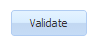

Component attributes:

================  ===================================================  ========================  ==========
Name              Description                                          Possible Values           Expression
================  ===================================================  ========================  ==========
Name              Component name                                       Any string                no
Text              Plain text or html to display within the component   Plain text or html        yes
Tooltip           Component tooltip                                    Any string                yes
Menu definition   Button can have a drop-down menu defined             Menu definition name      no
                  by this attribute
Tab Index         Controls the order of tabing (pressing the tab       Positive numeric value    no
                  key to move focus) within the page
Disabled          Disables or enables the button                       yes, no                   yes
Visible           Component visibility                                 yes, no                   yes
================  ===================================================  ========================  ==========

Example: this code in the button **click** system event makes the form validation.
::
	dataWidget.validate();

.. _textfield:

TextField
---------

This component is used to type the text information within the form.

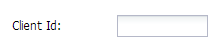

Component attributes:

================  ===================================================  ========================  ==========
Name              Description                                          Possible Values           Expression
================  ===================================================  ========================  ==========
Name              Component name                                       Any string                no
Label             Plain text or html to display as a component label   Plain text or html        yes
Label Align       Label alignment relative to the input field          left, top, right          no
Tooltip           Component tooltip                                    Any string                yes
Tooltip delay     Delay in milliseconds to show the tooltip            Numeric                   no
Tooltip position  Position of the tooltip relative to the input field  top, right, bottom, left  no
Required          Makes the input field required                       yes, no                   no
Read only         Makes the input field read only                      yes, no                   no
Password          Hides the user input                                 yes, no                   no
Mask              Regular expression mask to filter the user input     Regular expression        no
Tab Index         Controls the order of tabing (pressing the tab       Positive numeric value    no
                  key to move focus) within the page
Visible           Component visibility                                 yes, no                   yes
Empty Text        The default text to place into an empty field        Any string                yes
Max length        Maximum input field length allowed                   Numeric                   no
Text Align        Text alignment within input field                    left, right               no
Label Visible     Makes the component label visible or not             yes, no                   no
Text Transform    Automatically transforms the input field text into   uppercase, lowercase      no
                  upper or lower case
================  ===================================================  ========================  ==========

.. _datefield:

DateField
---------

This component is used to choose the dates within the form.

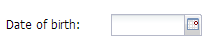

Component attributes:

================  ===================================================  ========================  ==========
Name              Description                                          Possible Values           Expression
================  ===================================================  ========================  ==========
Name              Component name                                       Any string                no
Label             Plain text or html to display as a component label   Plain text or html        yes
Label Align       Label alignment relative to the input field          left, top, right          no
Read only         Makes the input field read only                      yes, no                   no
Tab Index         Controls the order of tabing (pressing the tab       Positive numeric value    no
                  key to move focus) within the page
Visible           Component visibility                                 yes, no                   yes
Empty Text        The default text to place into an empty field        Any string                yes
Text Align        Text alignment within input field                    left, right               no
Label Visible     Makes the component label visible or not             yes, no                   no
================  ===================================================  ========================  ==========

.. _numberfield:

NumberField
-----------

This component is used to type the numeric values within the form. By default, it has an up/down spinner buttons letting to increment and decrement the value of the field.

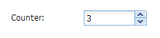

Component attributes:

================  ===================================================  ========================  ==========
Name              Description                                          Possible Values           Expression
================  ===================================================  ========================  ==========
Name              Component name                                       Any string                no
Label             Plain text or html to display as a component label   Plain text or html        yes
Label Align       Label alignment relative to the input field          left, top, right          no
Value             Initial value                                        Numeric                   yes
Step              Defines the incrementing/decrementing step value     Numeric                   no
Read only         Makes the input field read only                      yes, no                   no
Tab Index         Controls the order of tabing (pressing the tab       Positive numeric value    no
                  key to move focus) within the page
Visible           Component visibility                                 yes, no                   yes
Empty Text        The default text to place into an empty field        Any string                yes
Step              Defines the incrementing/decrementing step value     Numeric                   no
Max length        Maximum input field length allowed                   Numeric                   no
Text Align        Text alignment within input field                    left, right               no
Label Visible     Makes the component label visible or not             yes, no                   no
Max Value         Maximum possible value                               Numeric                   yes
Min Value         Minimum possible value                               Numeric                   yes
================  ===================================================  ========================  ==========

.. _combobox:

ComboBox
--------

This is the drop down list letting the user to choose one value from the list.

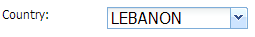

The combobox component is usually used with the DataQuery that can be configured in the **values** attribute.

Component attributes:

================  ===================================================  ========================  ==========
Name              Description                                          Possible Values           Expression
================  ===================================================  ========================  ==========
Name              Component name                                       Any string                no
Label             Plain text or html to display as a component label   Plain text or html        yes
Label Align       Label alignment relative to the input field          left, top, right          no
Values            Component values. Clicking on this attribute opens   Numeric                   no
                  a screen to connect the component to the DataQuery
Read only         Makes the component input field read only            yes, no                   no
Editable          Makes the component input field editable or  not     yes, no                   no
Tab Index         Controls the order of tabing (pressing the tab       Positive numeric value    no
                  key to move focus) within the page
Visible           Component visibility                                 yes, no                   yes
Empty Text        The default text to place into an empty field        Any string                yes
Step              Defines the incrementing/decrementing step value     Numeric                   no
Max length        Maximum input field length allowed                   Numeric                   no
Text Align        Text alignment within input field                    left, right               no
Label Visible     Makes the component label visible or not             yes, no                   no
Text Transform    Automatically transforms the input field text into   uppercase, lowercase      no
                  upper or lower case
================  ===================================================  ========================  ==========

.. _checkbox:

CheckBox
--------

Classical checkbox component, used to choose between values like yes/no, true/false etc.

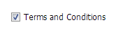

Component attributes:

================  ===================================================  ========================  ==========
Name              Description                                          Possible Values           Expression
================  ===================================================  ========================  ==========
Name              Component name                                       Any string                no
Label             Plain text or html to display as a component label   Plain text or html        yes
Label Position    Label position relative to the checkbox              before, after             no
Read only         Makes the component read only                        yes, no                   no
Disabled          Disables or enables the component                    yes, no                   no
Default State     Default state of the checkbox                        checked, unchecked        no
Checked Value     Used to pass the value when the checkbox is checked  Any string                no
Unchecked Value   Used to pass the value when the checkbox is          Any string                no
                  unchecked
Tab Index         Controls the order of tabing (pressing the tab       Positive numeric value    no
                  key to move focus) within the page
Visible           Component visibility                                 yes, no                   yes
================  ===================================================  ========================  ==========

Two arguments make the checkbox different from other components:

* **Checked Value:** used to pass the value when the checkbox is checked. By default, the value is *"on"*. If it's empty, the default value will be passed.
* **Unchecked Value:** used to pass the value when the checkbox is checked. By default, the value is empty and *null* will be passed in that case.

How to use **element.setValue()** method with checkbox:

* To check the ckeckbox:

   * If the **Checked Value** attribute has the default value (*on*), **element.setValue('on')** will check the component state.
   * If the **Checked Value** attribute does not have the default value (e.g. it has *yes*), **element.setValue('yes')** will check the component state.
   * **element.setValue(true)** will *always* check the component state.

* To uncheck the ckeckbox:

   * Any value passed by **element.setValue()** method will uncheck the component state except *true* and the current value of the **Checked Value** attribute.

Example: to check the component state (*MY_CHECKBOX* is the checkbox name).
::
	var my_checkbox = dataWidget.getElementByName('MY_CHECKBOX');
	my_checkbox.setValue(true);

Example: to uncheck the component state (*MY_CHECKBOX* is the checkbox name).
::
	var my_checkbox = dataWidget.getElementByName('MY_CHECKBOX');
	my_checkbox.setValue(false);

.. _textarea:

TextArea
--------

This component is used to type the large text information within the form.

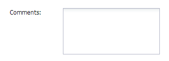

Component attributes:

================  ===================================================  ========================  ==========
Name              Description                                          Possible Values           Expression
================  ===================================================  ========================  ==========
Name              Component name                                       Any string                no
Label             Plain text or html to display as a component label   Plain text or html        yes
Label Align       Label alignment relative to the input field          left, top, right          no
Read only         Makes the input field read only                      yes, no                   no
Tab Index         Controls the order of tabing (pressing the tab       Positive numeric value    no
                  key to move focus) within the page
Visible           Component visibility                                 yes, no                   yes
Empty Text        The default text to place into an empty field        Any string                yes
Max length        Maximum input field length allowed                   Numeric                   no
Text Align        Text alignment within input field                    left, right               no
Label Visible     Makes the component label visible or not             yes, no                   no
Text Transform    Automatically transforms the input field text into   uppercase, lowercase      no
                  upper or lower case
================  ===================================================  ========================  ==========

.. _generalBasicGcApi:

General API
-----------
There are several methods common for all basic graphical components:

.. js:function:: setValue( value )
   
   Set and display the value passed as parameter in the text component.

   :param string value: the value to display.

.. js:function:: getValue()

   :returns: the current value associated with the component.

Example: this code changes the Text component value if Checkbox component was checked.
::
   var myCheckbox = dataWidget.getElementByName('MY_CHECKBOX');
   var myText = dataWidget.getElementByName('MY_TEXT');

   if (myCheckbox.getValue() == "on")
      myText.setValue("bla bla");

.. _layoutsComps:

Layouts and Containers
^^^^^^^^^^^^^^^^^^^^^^

* :ref:`FieldSet <fieldset>`
* :ref:`Panel <panel>`
* :ref:`Vertical Panel <vertpanel>`
* :ref:`Tab Panel <tabpanel>`
* :ref:`PanelSplitter <panelsplitter>`

.. _fieldset:

FieldSet
--------

This is the container usually used to contain the form fields elements.

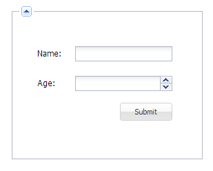

.. _panel:

Panel
-----

This is the simplest container used to group any graphical components including other panels.

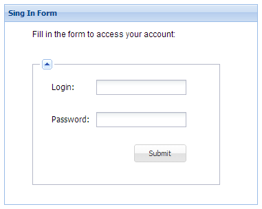

.. _vertpanel:

Vertical Panel
--------------

This is the same as a simple panel but using the vertical layout.

.. _tabpanel:

Tab Panel
---------

This is the classical tab panel used to group the information in the different tabs:

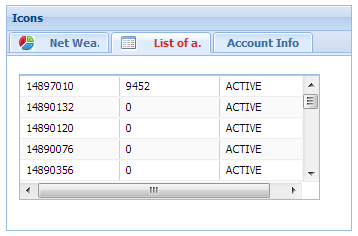

.. _panelsplitter:

PanelSplitter
-------------

This is the container used to split several panels horizontally or vertically.

Example: horizontal layout, one panel with a title, another one iwhtout title.

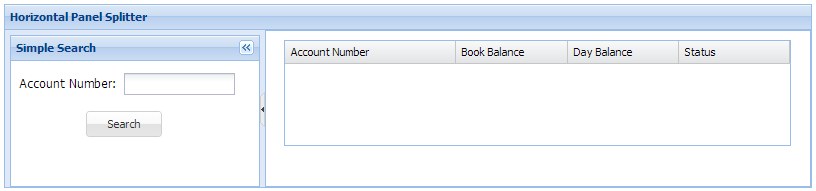

Example: vertical layout.

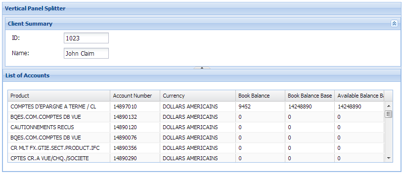

.. _customComps:

Custom
^^^^^^

Any combination of graphical controls can be saved for the future usage as a Custom Graphical Control. To do it, select the component and click the "Save as Custom Control" button at the top right corner of the Widget Builder design area. It opens a popup window:

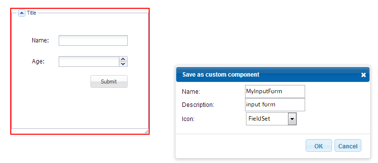

After clicking *Save*, this component will appear in the Widget Builder *Custom Elements* panel. This component can be used in the future development just like any basic component, with its attributes, styles etc.