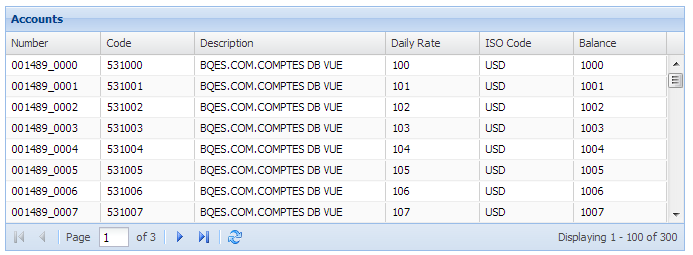
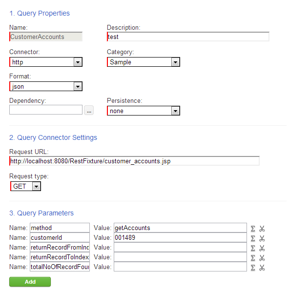
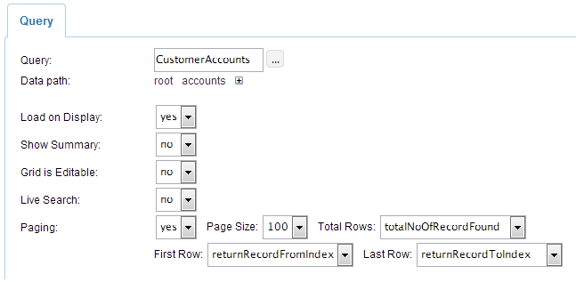

.. image:: http://www.dreamface-interactive.com/img/dreamface-interactive.png

DreamFace's Grid Graphical Component
====================================

Grid is the one of the most complex graphical components in the DreamFace's toolbox. It's used to  interactively show the information in the form of the table with different possibilities like summarising the column values, edit selected cells etc.

* :ref:`Basic Usage <basicUsage>`
* :ref:`Columns Summary <columnsSummary>`
* :ref:`Grouping Rows <groupingRows>`
* :ref:`Locking Columns <lockingColumns>`
* :ref:`Editing Rows <editingRows>`
* :ref:`Live Search <liveSearch>`
* :ref:`Paging and Passing Parameters to DataQuery<pagingAndPassingParams>`
* :ref:`Refreshing the Chart depending on the Grid Column <dynChartsLinkedToGrid>`
* :ref:`Putting the Charts in the Grid Column <dynChartsInGrid>`
* :ref:`Grid Sizing Relatively to the Wrapping Container <gridSizing>`

.. _basicUsage:

Basic Usage
----

.. _columnsSummary:

Columns Summary
------

To show the summary of the grid column, developer has to open the **values** attribute and put the value of the **Show Summary** parameter to **yes**. This will add one more parameter to the **Columns Definition** section named **Summary Type**. It can have several values:

* none - this column will not be summarized.
* count - row numbers will be shown.
* min - minimum value will be shown.
* max - maximum value will be shown.
* average - average value will be shown.

**Important:** be carefull with the column type, e.g. if the column type is **Numeric**, it makes perfect sense to summarize it with type **average**, but if the column type is **String** - summarizing by average will give the senseless result.

Another important attribute appearing if the gird columns can be summarized is **Summary Renderer** - it appears near the **Summary Type** parameter in the **Columns Definition** section:

.. js:function:: renderer(value, summaryData, dataIndex)
	
   Summary renderer function.

   :param numeric value: Summary value.

   :param object summaryData: Object containing the columns internal indexes and summary values.

   :param string dataIndex: The column name.

Example: grid with column *Age* summarized by average.

The **Summary renderer** of the *Age* column contains the code to highlight the summary value by different colors according to the condition:
::
	if (value < 30)
	   return "" + value + "";
	else
	   return "" + value + "";

**Note** also, that summary functionality can be used with groupped rows as well as with the whole grid.

.. _groupingRows:

Grouping Rows
---------

Grouping rows means that the data in the grid will be grouped by one of the columns.

To make the grid groupable, developer has to open the **values** attribute, open the **Columns Definition** section and put **Groupable** of any selected column to **yes**. The special icon will appear near the column name noting that this column is groupable.

Note, that only one column at a time can be groupable.

If the column is groupable, two new attributes appear: **Collapsed** - means that the rows will be initially collapsed and **Hide Column** - means that this column will be initially hidden.

Example: the grid with two editable and one not editable columns.

Note also, if the grid is groupable, there will be two new items in the grid columns runtime menu:

* Group by this field - to change the groupable column in runtime.
* Show in groups - to make/cancel the grid groupable.

.. _lockingColumns:

Locking Columns
---------

Locking column means that if the grid has a horizontal scrollbar, it will be applied to all the columns except the locked one.

Example: the grid with the locked column *Account*.

To lock the column, developer has to open the **values** attribute, go to the **Columns Definition** section and put the **Frozen** parameter value to **yes**.

.. _editingRows:

Editing Rows
-----------

To edit the selected Grid row, user has to open the Grid **values** attribute and put the **Grid is Editable** parameter to **yes**. It will automatically add an attribute **Editable** to every column in the **Columns definition** section. This attribute must be set to **yes** for the columns that can be edited by the user during the runtime.

Note, that columns will be edited according to their type, e.g. if the type is *Date*, the column will have a calendar editor.

To open the row editor, user has to double click on the selected row. Also, two buttons appear to update the values and cancel the editing.

If any cell value is changed, the selected row will be marked by the red color at the top left corner of the row.

Example: the grid with two editable and one not editable columns.

Validate Editing Values
^^^^^^^^^^^^^^^^^^^^^^^

To validate the edited values, developer should use the **validateedit** Grid System Event:

.. js:function:: validateedit(dataWidget, params, element)
	
   Validates editable value. Triggered just after user clicked the *Update* button and before closing the editor.

   :param object dataWidget: The datawidget instance.

   :param object params: Parameters. The object has several properties: **grid** (*object*) - the grid instance, **record** (*object*) - current row instance, **index** (*number*) - row index in the grid, **e** (*object*) - event object instance.

   :param object element: DFExtComponent instance.

Example: this code forbids to type "Smith" as a value for the *Last Name* column. If the value equals "Smith", the editor will not be closed.
::
	if (params.e.newValues.lastName == "Smith")
	    params.e.cancel = true;
	else
	    params.e.cancel = false;

.. _liveSearch:

Live Search
--------

Live Search capability lets user to find and highlight the data that have already been downloaded by the grid. This functionality can work in two ways:

* With a preconfigured toolbar containing all the necessary buttons and fields.
* Programmatically, using the Live Search Grid API.

Live Search with Preconfigured Toolbar
^^^^^^^^^^^^^^^^^^^^^^^^^^^^^^^^^^^^^^

To use the preconfigured Live Search toolbar, user has to open the Grid **values** attribute and put both the **Live Search** and **Show Toolbars** parameters to **yes**. 

As a result, the Grid will have a Live Search toolbar with a text filed to type the looking value, buttons **Next** and **Previous** and a checkbox to filter the case sensitivity of the looking values. The found values will be highlighted by the color. The row containing the currently selected value will be higlighted as well.

Also, at the bottom of the grid, there will be status bar showing the number of the found values.

Programmatical Live Search
^^^^^^^^^^^^^^^^^^^^^^^^^^

Sometimes, developer does not want to use the preconfigured toolbars and wants more flexibility. For such cases, there is a Grid Live Search API. Using this API, developer can use only one text field without any buttons or with them. Any component can use this API that gives the developer a very flexible system. Also, one text filed can be used for searching in several grids.

To use this functionality, user has to open the Grid **values** attribute and put the **Live Search** parameter value to **yes**.

Live Search API is attached to the Grid instance and containes the following functions:

.. js:function:: liveSearch.search( dataToSearch )
	
   Searches the passed data in the Grid instance.

   :param object value: Data to search. The object has several properties: **text** (*string*) - text to search, **caseSensitive** (*boolean*) - case sensitive or not, **statusCallback** - callback function passing the status text as an argument containing the number of entries found.

.. js:function:: liveSearch.searchPrevious()
	
   Highlights the previous found entry in the grid.

.. js:function:: liveSearch.searchNext()
	
   Highlights the next found entry in the grid.

Example:

Grid's **name** attribute is *PEOPLE_GRID*. TextFiled component contains this code in the **change** system event:
::
	var peopleGrid = dataWidget.getElementByName('PEOPLE_GRID').getExtComponent();

	peopleGrid.liveSearch.search({text:element.getValue(),
                     		      caseSensitive:false, 
		                      statusCallback:function(statusText){console.log(statusText);}
                    		     });

Button *Previous* contains this code in the **click** system event:
::
	var peopleGrid = dataWidget.getElementByName('PEOPLE_GRID').getExtComponent();
	peopleGrid.liveSearch.searchPrevious();

Button *Next* contains this code in the **click** system event:
::
	var peopleGrid = dataWidget.getElementByName('PEOPLE_GRID').getExtComponent();
	peopleGrid.liveSearch.searchNext();

.. _pagingAndPassingParams:

Paging and Passing Parameters to DataQuery
--------

Paging is used in cases when there is a large amount of records and lets the developer to limit the data exchange between the browser and Web Service. With paging, user scrolls through thousands of records by the small chunks - pages. Each time user wants to see the next page, browser sends a new request to the Web Service and gets back only the records on this selected page.

This functionality can work in two ways:

* With a preconfigured toolbar containing all the necessary buttons and fields.
* Programmatically, using the Paging API.

Example: Paging with a preconfigured toolbar.

To use paging, developer has to configure two components: *DataQuery* and *Grid*. The *DataQuery* component has to be configured in both cases - using the preconfigured toolbar or using API.

Configuring the DataQuery for Paging
^^^^^^^^^^^^^^^^^^^^^^^^^^^^^^^^^^^^

Using DataQuery for Paging means that developer has to configure the Paging parameters according to the Web Service structure. Paging uses several parameters (see the :ref:`Programmatical API for Paging <pagingApi>` section) but for the DataQuery developer has to configure:

* The name of the Web Service parameter to pass the first record number.
* The name of the Web Service parameter to pass the last record number.
* The name of the Web Service parameter to pass the total number of records found.
* Any other parameters necessary for the particular Web Service.

Any Web Service working with Paging, must treat the first two parameters and return back the third one (and eventually, the data).

Example: DataQuery used to get customer accounts. Parameters: 

* returnRecordFromIndex - name of the parameter used to pass the first record number.
* returnRecordToIndex - name of the parameter used to pass the last record number.
* totalNoOfRecordFound - name of the parameter to return the total number of records found.
* method - parameter used by this particular service to know the method name.
* customerId - parameter used by this particular service to know the customer ID.

**Important:** the records number starts from 0 (zero). For example, to get first five records, Paging will send to Web Service **returnRecordFromIndex = 0** and **returnRecordToIndex = 4**.

Configuring the Grid to use the Paging Toolbar
^^^^^^^^^^^^^^^^^^^^^^^^^^^^^^^^^^^^^^^^^^^^^^

To use the preconfigured Paging toolbar, user has to open the Grid **values** attribute and put both the **Load on Display** and **Paging** parameters to **yes**. There will be four new parameters near the **Paging**:

* Page Size - number of records to show on the page.
* Total Rows - name of the parameter used by Web Service (and configured in DataQuery) to return the total number of records found.
* First Row - name of the parameter used by Web Service (and configured in DataQuery) to pass the first record number.
* Last Row - name of the parameter used by Web Service (and configured in DataQuery) to pass the last record number.

Total Rows, First Row and Last Row parameters contain the Comboboxes with a list of the DataQuery parameters. Developer has to map the appropriate parameter names.

Example:

Paging Toolbar has several components (see the picture at the beginning of the :ref:`Paging <pagingAndPassingParams>` section):

* Buttons to move to the next/previous/first/last page.
* Input field showing the current page. The current page can be changed if the user types page number and clicks *Enter*.
* Refresh button - to refresh the current page.
* Label showing which record numbers are currently on the page.

.. _pagingApi:

Programmatical API for Paging
^^^^^^^^^^^^^^^^^^^^^^^^^^^^^

Paging can be used without preconfiguring the toolbar, but with **DFExtComponent.loadData()** function:

.. js:function:: loadData(webServiceParams, pagingInfo)
	
   This function is called to load data from DataQuery.

   :param object webServiceParams: Object containing parameters necessary for the Web Service structure.

   :param object pagingInfo: Paging parameters. The object has several properties: **pageSize** (*numeric*) - number of records per page, **firstRowParamName** (*string*) - name of the parameter used by Web Service to pass the first record number, **lastRowParamName** (*string*) - name of the parameter used by Web Service to pass the last record number, **totalRowsParamName** (*string*) - name of the parameter used by Web Service to return the total number of records found.

**Note:** in the case of using Paging API, developer does not have to configure the Paging Toobar, it'll be done automatically.

**Important:** do not forget that any parameters passed to the **DFExtComponent.loadData()** function must be previously configured in DataQuery (can be without values).

Example: code in the **change** system event of the Combobox component containing the customer IDs list. *ACCOUNTS_GRID* is the Grid component name.
::
	var customerId = element.getValue();
	var accountsGrid = dataWidget.getElementByName("ACCOUNTS_GRID");
	accountsGrid.loadData({customerId: customerId},
				{pageSize: 50, firstRowParamName: "returnRecordFromIndex", lastRowParamName: "returnRecordToIndex", totalRowsParamName: "totalNoOfRecordFound"});

.. _dynChartsLinkedToGrid:

Refreshing the Chart depending on the Grid Column
--------

.. _dynChartsInGrid:

Putting the Charts in the Grid Column
--------

.. _gridSizing:

Grid Sizing Relatively to the Wrapping Container
------------------------------------------------

Sometimes the Grid has the size which is bigger than its wrapping contaner. In such cases, grid can be configured to have the appropriate scrollbars appearing automatically.

Example: two grids, within the **FieldSet** and **Panel** layout components.

As you can see, if Style parameters **width** and **height** of the Grid are bigger than such parameters of the wrapping container, the scrollbars automatically appear.

**Important:** to make it working, the internal Grid component must have its Style parameter **position** to be **relative**.

**Note:** this functionality works with **FieldSet** and **Panel** layout components.