.. image:: /images/df_logo.png

Guides
======

DreamFace provides several guides to give developers best practices in implementing sophisticated and powerful
features required when developing an Enterprise Cloud application:

* :ref:`Start DreamFace Studio <startstudio>`
* :ref:`Create an application <createapplication>`
* :ref:`Create a DataWidget <createdw>`
* :ref:`Form Validation <formvalidation>`
* :ref:`Form Validation Rules <validRules>`
* :ref:`Using Expressions <expressions>`
* :ref:`Using Soft Events and Application Context <softEvents>`

.. _startstudio:

Start DreamFace Studio
----------------------

To start DreamFace studio, open your Internet Browser and go to your cloud server:
http: // [**server**]/DreamFace/http_login/tn/[**tenant**]/DreamFaceStudio.

Replace [**server**] and [**tenant**] with the appropriate values given by your cloud administrator.

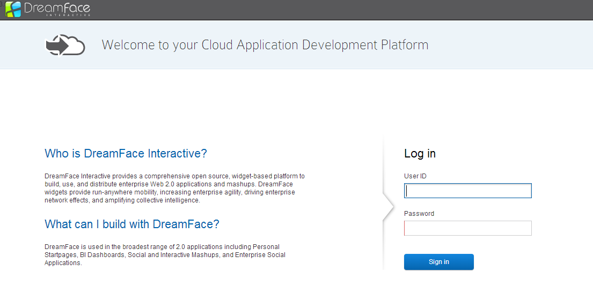

Type your *User ID* and *Password* and click the *Sign in* button.

Default **User ID**: **John**

Default **Password**: **admin**

.. _createapplication:

Create an Application
----------------------

A DreamFace application represents a simple or complex sequence of screens. To create an application, go to the *Home* menu: at the left of the screen, you'll see the list of existing applications and *Create* button at the end of this list. Click on this button and *Create a new application* form will be displayed:

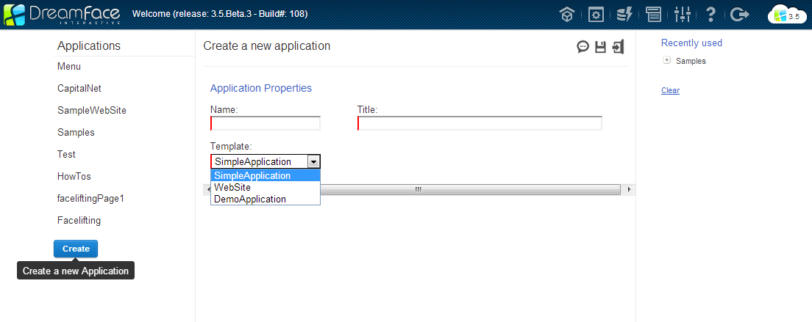

Application properties:

=============================  =============================================================  ========================
Name                           Description                                                    Possible Values         
=============================  =============================================================  ========================
Name                           Application name                                               String              
Title                          Application title                                              String
Template                       Application template name. Initially you have one template:    String from drop-down list
                               SimpleApplication
=============================  =============================================================  ========================

After clicking *Save* button at the top right of the *Create a new application* area, new application is created with default values, for example, there will already be a *Home* screen (highlighted in **bold**):

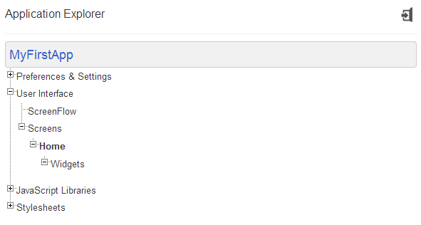

That's it, you already have your first application! Now, it's time to :ref:`create a Widget. <createdw>`

.. _createdw:

Create a DataWidget
-------------------

To create a widget, go to the *Home* screen and click *Widgets* button at the top right of the screen - in the main menu:

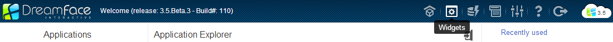

It opens a screen where you can search for a particular widget or look at all widgets at once (leave the input field field empty and click the *Search* button for that).

To open a widget creation screen, click on the *create a widget* button like on the picture:

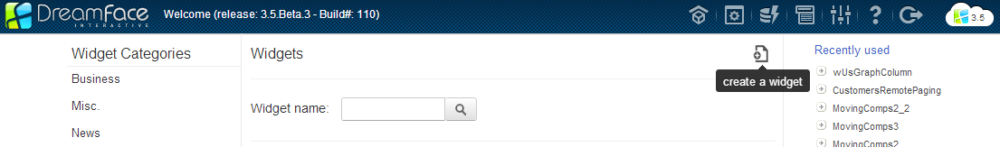

It opens a screen where you can fill the widget properties:

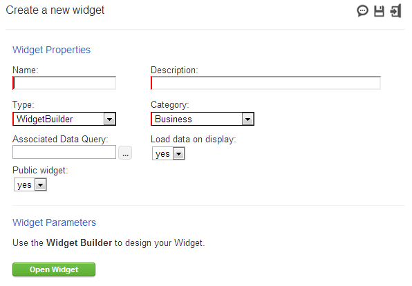

=============================  =============================================================  ========================
Name                           Description                                                    Possible Values         
=============================  =============================================================  ========================
Name                           Widget name. Blanks and special characters are not allowed     String              
Description                    Widget description                                             String
Type                           There are four widget types now: WidgetBuilder and             String from drop-down list
                               JavaScriptToolkit
Category                       Widget category                                                String from drop-down list
Associated Data Query          The DataQuery, associated with the widget                      String, Data Query name
Load data on display           Defines if the Data Query will be executed at the same time    yes, no
                               as the widget will be displayed
Public widget                  Defines if this widget is public (future release)              yes, no
=============================  =============================================================  ========================

To save the widget, click the *save the widget* button at the top of the *Create a new widget* area.

The *WidgetBuilder* is the default type and means that the widget can be constructed using the WidgetBuilder. If you create this type of widget, you can directly open a Widget Builder clicking the *Open Widget* button at the bottom of the *Create a new widget* area.

To add a widget to the screen, you should open the screen (select your application on the Studio Home page, click *User Interface* and *Screens*) and click the *Open/Close the Widget catalog* button.

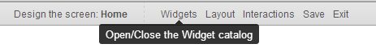

It will open the widget catalog where you can drag your widget and drop it to the selected screen area - you can see the screen areas on the right of the widget catalog.

.. _formvalidation:

Form Validation
---------------

When you develop a form with DreamFace, you can attach validation rules to each field (TextField, DateField, NumberField,
ComboBox, ...). You may want to validate all fields by verifying their respective validation rules. To do so, the DataWidget
object provides a *validate()* method that will evaluate validation rules and set a status on each field. The status can have 3 different
states:

* unvalidated: the field has not been validated yet
* validated: the validation rules has been verified
* error: the validation rules triggered an error.

Example:
::
	dataWidget.validate();

The datawidget has also a global validation status that is set according to the status of all fields:

* error: at least one field is in error mode. This status has the highest priority
* unvalidated: at least one field has not been validated yet
* validated: all fields are in success mode.

To check the global validation status of a widget, we use the method *getValidationStatus()*, such as:

Example:
::
	if (dataWidget.getValidationStatus()=="validated") {
		alert( "all fields have been validated" );
	};

.. _validRules:

Form Validation Rules
----------------

To validate the form, developer has to define the **Validation Rules** for every form field in the component attributes section. After that, he needs to call somewhere **dataWidget.validate()** method (see the :ref:`Form Validation Guide <formvalidation>` for details).

Example: form containing two fields with defined validation rules and a button to validate the entire form.

.. image:: images/valid_form.png

Definition of the the validation rules is doing in the popup window. To get the code returning the current element value in runtime, click on *this* element in the bottom left area, then click on *Properties* in the bottom right area and double click on *value*:

.. image:: images/valid_rules.png

After that, code the application logic. The code of the *Name* field validation rules will be:
::
	if ("{this.Properties.value}" == '')
	    return false;
	else
	    return true;

The code of the *Age* field validation rules will be:
::
	if ("{this.Properties.value}" < 0)
	    return false;
	else
	    return true;

And the code of the **click** system event of the *Submit* button will be:
::
	dataWidget.validate();

As a result, if the user clicks on the *Submit* button when *Name* field is empty, this field will be highlighted by the red border:

.. image:: images/valid_error.png

.. _expressions:

Using Expressions
----------------

Expressions are very very powerfull part of the DreamFace platform. Using expressions lets the components to change its behavior in runtime depending on other components or conditions.

To use expressions, select the graphical component and click on the expressions icon near the component attribute that must change its behavior in runtime. It opens an Expression Builder in the popup window. Select the global element in the bottom left area and its property in the bottom right area - it will paste an appropriate expression to the javascript editor.

Example: make email input field visible only if the checkbox is checked

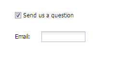

Expression Builder window opened after clicking on the *Expression* icon of the **visible** attribute of the *Email* component:

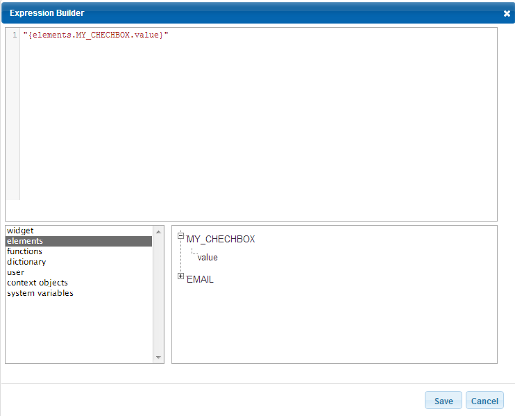

MY_CHECHBOX - Checkbox component name, EMAIL - TextField component name.

Code that must be put in the Expression Builder:
::
	if ("{elements.MY_CHECHBOX.value}" == "on")
	   return "yes";
	else 
	   return "no";

Example: this code, placed in the expressions of the *Disabled* attribute of the Submit button, enables the button only if the widget validation status is *validated*:
::
	return (("{widget.Properties.validationStatus}"=="validated")? "no" : "yes");

.. _softEvents:

Using Soft Events and Application Context
----------------
Soft Events are used to make a loosely coupled communication between the widgets. To decalre a soft event, go to the *Settings* item of the global menu, click *General -> Events* on the left and click a button to add a new event.

Example: two widgets communicating with each other. Changing the value of the combobox *Type* refreshes the data in the grid.

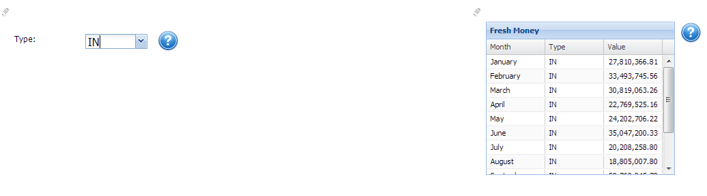

First, decalare new soft event:

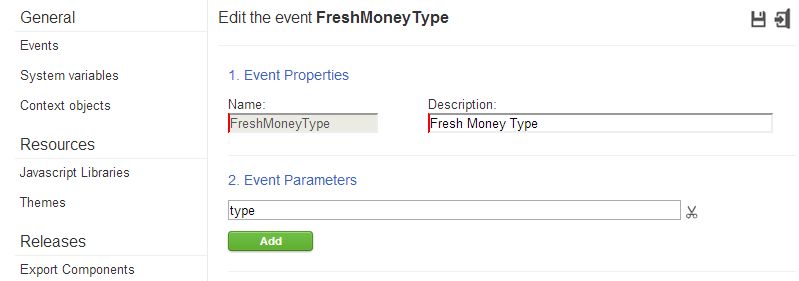

Second, publish a soft event in the **change** system event of the combobox in the first widget (use *Paste Event* button at the top of the JavaScript Editor):
::
	dataWidget.publishEvent( "FreshMoneyType", [params.newValue])

Parameters are: soft event name and new combobox value.

Third, in the *Widget Application Events* (widget - not grid) panel of the widget containing the grid, subscribe on the soft event and put there the code:
::
	var grid = dataWidget.getElementByName("money_grid");
	dfSetContextValue("money", "type", type, 
        	          function(){
                	      grid.loadData();   
                  	});

This code puts in the application context an object *money* with a property *type* and a value that is passed to the event during publishing (*type* is an agrument passed to the event decalred earlier - now it contains a new combobox value). *money_grid* is a grid component name. Callback function contains a code to load data in the grid.

Fouth, put the code in the **init** system event of the grid to define an initial value:
::
	var grid = dataWidget.getElementByName("money_grid");
	dfSetContextValue("money", "type", "", 
        	          function(){
                	  });

Last, redefine the DataQuery parameter (used by the grid) to use the context value:

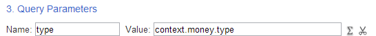