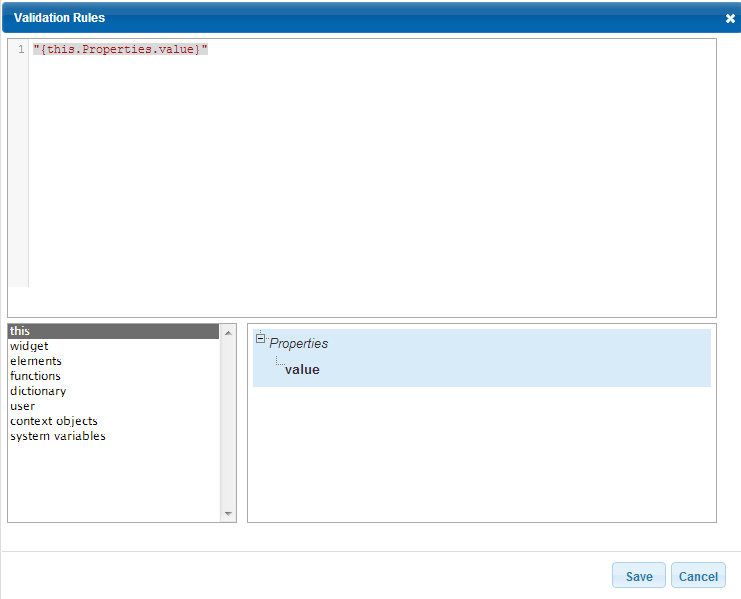
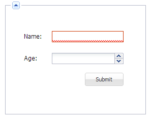

.. image:: /images/df_logo.png

Guides
======

DreamFace provides several guides to give developers best practices in implementing sophisticated and powerful
features required when developing an Enterprise Cloud application:

* :ref:`Start DreamFace Studio <startstudio>`
* :ref:`Create an application <createapplication>`
* :ref:`Create a DataWidget <createdw>`
* :ref:`Form Validation <formvalidation>`
* :ref:`Form Validation Rules <validRules>`

.. _startstudio:

Start DreamFace Studio
----------------------

TBD.

.. _createapplication:

Create an Application
----------------------

TBD.

.. _createdw:

Create a DataWidget
-------------------

TBD.

.. _formvalidation:

Form Validation
---------------

When you develop a form with DreamFace, you can attach validation rules to each field (TextField, DateField, NumberField,
ComboBox, ...). You may want to validate all fields by verifying their respective validation rules. To do so, the DataWidget
object provides a *validate()* method that will evaluate validation rules and set a status on each field. The status can have 3 different
states:

* unvalidated: the field has not been validated yet
* validated: the validation rules has been verified
* error: the validation rules triggered an error.

Example:
::
	dataWidget.validate();

The datawidget has also a global validation status that is set according to the status of all fields:

* error: at least one field is in error mode. This status has the highest priority
* unvalidated: at least one field has not been validated yet
* validated: all fields are in success mode.

To check the global validation status of a widget, we use the method *getValidationStatus()*, such as:

Example:
::
	if (dataWidget.getValidationStatus()=="validated") {
		alert( "all fields have been validated" );
	};

.. _validRules:

Form Validation Rules
----------------

To validate the form, developer has to define the **Validation Rules** for every form field in the component attributes section. After that, he needs to call somewhere **dataWidget.validate()** method (see the :ref:`Form Validation Guide <formvalidation>` for details).

Example: form containing two fields with defined validation rules and a button to validate the entire form.

.. image:: images/valid_form.png

Definition of the the validation rules is doing in the popup window. To get the code returning the current element value in runtime, click on *this* element in the bottom left area, then click on *Properties* in the bottom right area and double click on *value*:

After that, code the application logic. The code of the *Name* field validation rules will be:
::
	if ("{this.Properties.value}" == '')
	    return false;
	else
	    return true;

The code of the *Age* field validation rules will be:
::
	if ("{this.Properties.value}" < 0)
	    return false;
	else
	    return true;

And the code of the **click** system event of the *Submit* button will be:
::
	dataWidget.validate();

As a result, if the user clicks on the *Submit* button when *Name* field is empty, this field will be highlighted by the red border:

